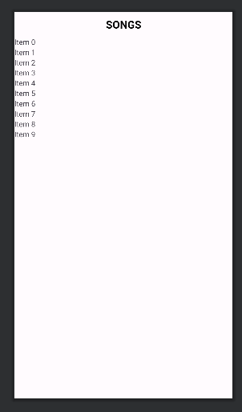
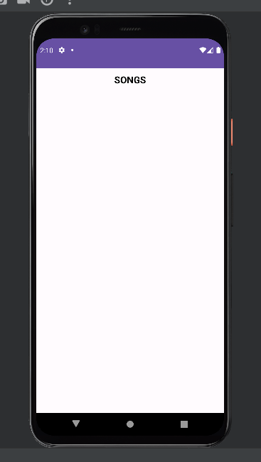
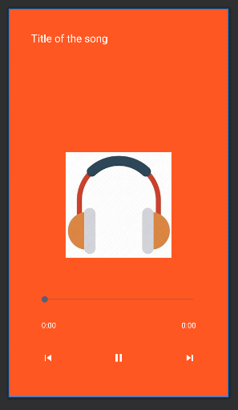

# AndroidStudios-MyMusicApp

## Description
Developed a music player app, "MyMusicApp," using Android Studio following a tutorial. The app features music selection and playback controls, including play, pause, next, and previous functionalities.

## Screenshots/GIFs

## Features
- Music player functionality
- Selection of music tracks
- Playback controls (play, pause, next, previous)

## Tutorial Reference
This app was developed based on the tutorial [Music Player Application | Android Studio Tutorial | 2024  /  https://www.youtube.com/watch?v=1D1Jo1sLBMo].

## Technologies Used
- Android Studio
- Java

## Installation
To run this project locally, follow these steps:
1. Clone the repository:
Open the project in Android Studio.
Build and run the app on an emulator or a physical Android device.

# Usage
Once the app is running:

Select music tracks.
Utilize playback controls (play, pause, next, previous) to control music playback.
